 
## Assessing Multilple Dimensions

# Two Key Questions

<ol>
<li> What facets of knowledge, skills, or abilities (KSAs) are sought to be understood about a student?</li>
<li> What characteristics of the tasks/items may interfere with such understanding?</li>
</ol>

---

## Defining Terms I Will Use Today

>- Trait/Skill/Attribute/Ability/Dimension: 
>  - Score are numeric representations of traits
>- Assessment/test: A collection of tasks used to quantify scores
>- Item: A generic term for an assessment task
>- Person/student/examinee/respondent: The person taking the assessment
>- Psychometric Models/Methods: The mathematical linkage between the a student's performance and their score(s)

--- 

## Common Methods of Assessment

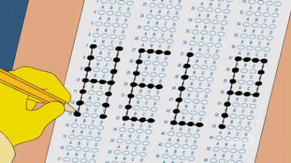

---

## Common Assessment Specifications

>- Most large-scale tests are scored using a unidimensional psychometric model
>- Unidimensional: One trait thought to underlie the items
>- One (main) score given to examinees
> 

 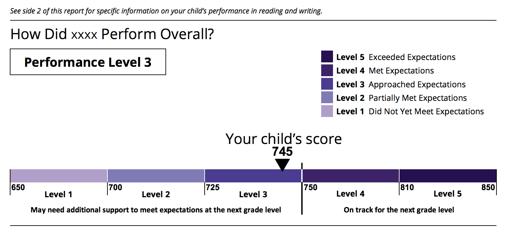
 

 

  Image source: <a href="http://www.parcconline.org/assessments/score-results/2016-score-reports"> 
  http://www.parcconline.org/assessments/score-results/2016-score-reports
  </a>

>- Sometimes more information is given...we will return to this shortly

---

## Assessment Specification Diagram

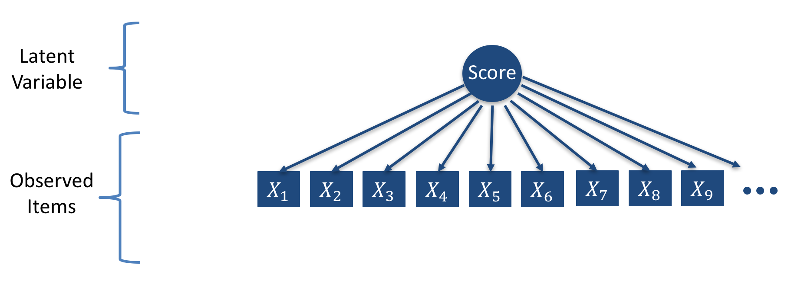

---

## Definitional Specificity of a Trait

>- The definitional specificity of a trait is referred to as the grain size
>  - Driven by the level of specificity with which one desires to make inferences about students on the basis of their test score(s)
>  - What you want to know about a student
>- In current summative testing, the grain size is often very coarse
>  - 4th Grade Math
>  - 7th Grade English Language Arts
>- So, if more detailed information is needed, a more specific definition is needed:
>  - A math example: <a href="https://turnonccmath.net/"> https://turnonccmath.net/ </a>

---

## But Not All Tests Can Be Unidimensional

As constructs and standards become more detailed, it becomes harder to create items that align well to one dimension
 

 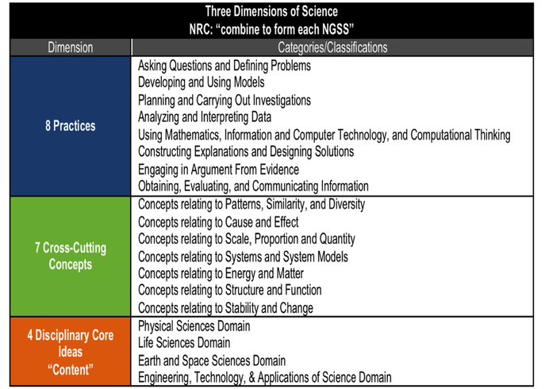
 

 

  Image source: <a href="http://www.p2learninggroup.com/next-generation-science-standards.html"> 
  http://www.p2learninggroup.com/next-generation-science-standards.html
  </a>

 

---

## Not Just NGSS/Math Practices

Consider the following item from a PARCC practice test:
<!-- 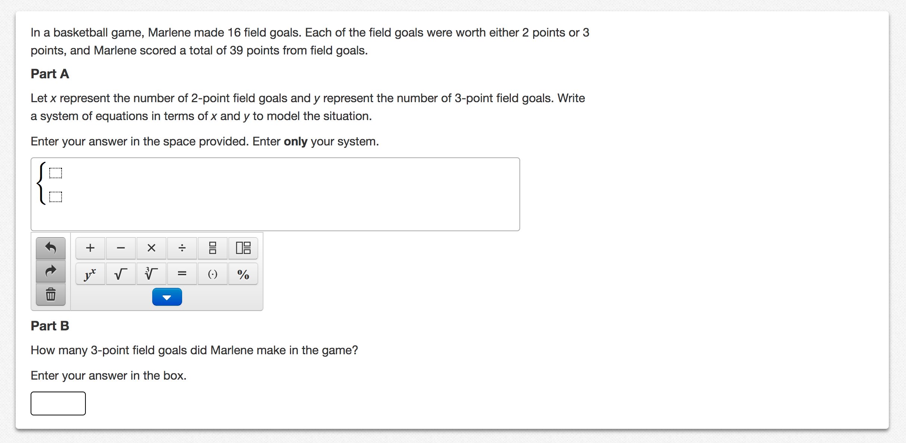 -->
 

 
 

 

  Image source: <a href="https://parcc.pearson.com/practice-tests/math/"> 
  https://parcc.pearson.com/practice-tests/math/
  </a> (Algebra I Practice Test)

---

## Possible Multidimensional Model

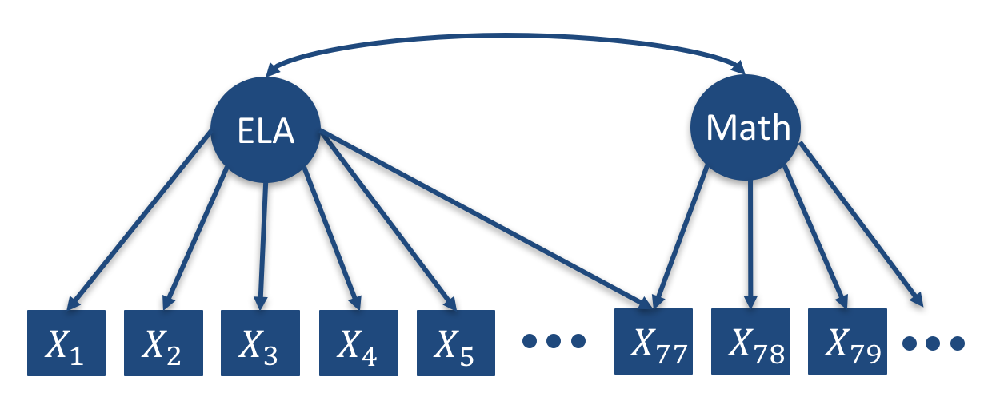

--- 

## Section Summary

>- Traits (and the scores that represent them) are made by definition (grain size)
>- Most large-scale tests assess one trait, providing one score
>- As definitional grain size narrows, more traits (and scores) are needed to describe behavior
>- Additional scores can be good things!

--- 

## Why Assess Multiple Dimensions?

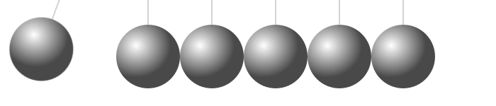

---

## Motivations for Multiple Dimensions

>- Additional information needed about student abilities 
>- Nature of some items necessitates multiple dimensions
>- Constructs/standards are inherently multidimensional

---

## Additional Information Needed

Additional information needed about student abilities (i.e., definition "grain size")

 

 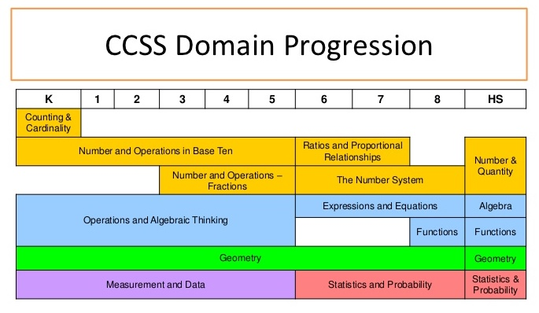
 

 

  Image source: <a href="https://www.slideshare.net/MarciShepard/common-core-state-standards-math-workgroup-training"> 
  https://www.slideshare.net/MarciShepard/common-core-state-standards-math-workgroup-training
  </a>

--- 

## Item Features are Multidimensional

# Nature of some items necessitates multiple dimensions (e.g. testlets)

- Example from PARCC practice test for ELA: <a href="https://parcc.pearson.com/practice-tests/english/"> https://parcc.pearson.com/practice-tests/english/</a>

__Technical details__:

Typical IRT Model

$$P\left(Y_{pi} = 1 \middle| \theta_p \right) = \frac{\exp\left(\theta_p - b_i \right)}{1 + \exp\left(\theta_p - b_i \right)}$$

Basic Testlet IRT Model

$$P\left(Y_{pi} = 1 \middle| \theta_p, \gamma_p \right) = \frac{\exp\left(\theta_p - b_i + \gamma_p \right)}{1 + \exp\left(\theta_p - b_i + \gamma_p \right)}$$

--- &nologo

## Item Content is Multidimensional

# Consider the Math Item from the PARCC Practice Test

 

 
 

 

  Image source: <a href="https://parcc.pearson.com/practice-tests/math/"> 
  https://parcc.pearson.com/practice-tests/math/
  </a> (Algebra I Practice Test)

---

## Multidimensional Model for the Math Item

Multidimensional Item Characteristic Curve

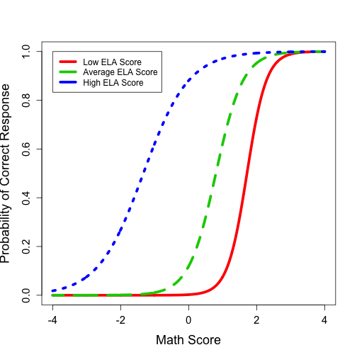

Multidimensional IRT Model

$P\left(Y_{pi} = 1 \middle| \text{ELA}_p, \text{Math}_p \right) = $

$$\frac{\exp\left(\beta_{0,i} + \beta_{ELA,i}\text{ELA}_p  + \beta_{Math,i}\text{Math}_p  + \beta_{Math \times ELA,i} \text{Math}_p  \text{ELA}_p \right)}{1 + \exp\left(\beta_{0,i} + \beta_{ELA,i}\text{ELA}_p  + \beta_{Math,i}\text{Math}_p + htt\beta_{Math \times ELA,i} \text{Math}_p  \text{ELA}_p \right)}$$

--- &twocol

## Standards are Multidimensional

*** {name: left}
- Example: Next Generation Science Standards
 

 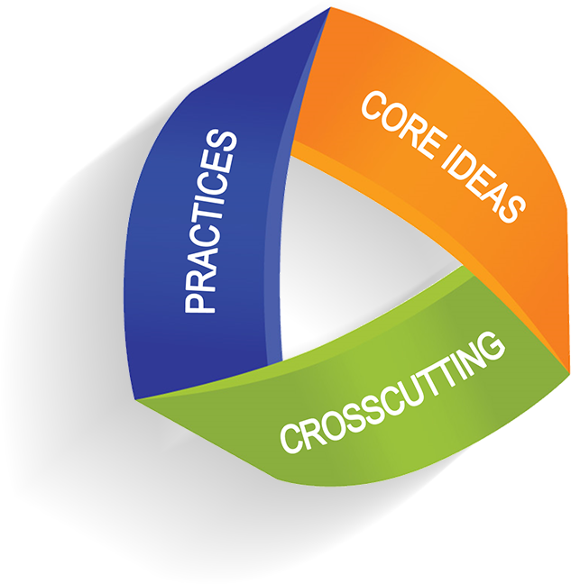
 

*** {name: right}
 

 
 

 

  Image source:   <a href="http://www.p2learninggroup.com/next-generation-science-standards.html"> 
  http://www.p2learninggroup.com/next-generation-science-standards.html
  </a>

---

## Section Summary

>- Sometimes, a single score is not sufficient to characterize student test performance, KSAs, or behavior
>- NGSS have multiple dimensions
>  - Core ideas
>  - Crosscutting concepts
>  - Practices

--- 

## Common Assessment Practices are Inadequate for NGSS Dimensions

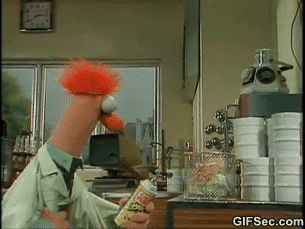

---

## Most Operational Multidimensional Models

>- Most large-scale summative testing programs are multidimensional...
>  - Multidimensional by a series of unidimensional tests
>- Separate assessment of multiple dimensions
>  - Example: Assessment of ELA separate from Mathematics
>- Even testing programs claiming new multidimensional models estimate each dimension separately
>  - Dynamic Learning Maps
>  - PARCC Formative Assessments
>- Bad pratice: Taking a single dimension and turn it into multiple dimensions
>  - Create single score with all items of an assessment (a unidimensional model)
>  - Then create subscores by taking items from different content domains/strands (implying multiple dimensions)
>  - Subscale scores are necessarily at a finer grain size, but...

---

 

 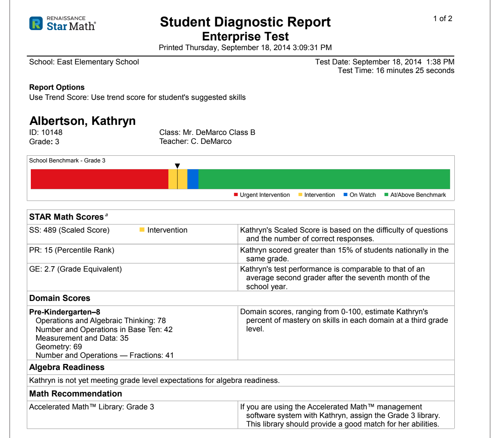
 

 

  Image source: <a href="http://doc.renlearn.com/KMNet/R0053249615EE616.pdf"> 
  http://doc.renlearn.com/KMNet/R0053249615EE616.pdf
  </a> (p. 8)

---

## Much Ado about Subscores

Harvesting subscale scores from unidimensional tests is problematic:
>- A uni- and multidimensional model both cannot be correct
>- If the unidimensional model was appropriate for the test:
>  - Subscale scores should see correlations approach 1.0 as the number of items increases
>- If the multidimensional model was appropriate for the test, then the unidimensional overall (total) score is not valid
>  - Either needs some type of arbitrary method for combining multiple scores (think Body Mass Index: total of height and weight of a person)
>  - Or, if calibrated with a unidimensional model, the score is likely is not as reliable as is being reported
>- Subscale scores likely represent error 
>  - Yet they are what are asked for the most by educators
>  - Grain size is information!

--- &nologo

<iframe src = "https://jtemplin.shinyapps.io/subscorecor/" style="width:100%; height=900px"></iframe>

---

## Section Summary

>- None of the commonly-used current large-scale assessment practices allow multiple traits to be measured by an item
>- In each method mentioned, each item only measures one trait
>- Items built for Next Generation Science Standards assessment inherently will measure more than one trait
>  - One core concept
>  - One or more cross-cutting ideas
>  - One or more practices

--- 

## Possible Models for Assessing NGSS

---

## Multidimensional  Model Familes

# Models That May Work for Assessing NGSS Multidimensionally

>- Multidimensional IRT Models (MIRT)
>- Diagnostic Classification Models (DCMs)
>- Of note: both are part of a larger family called Bayesian Inference Networks (BayesNets)

---

## What's in a Model

# Key Model Features

A psychometric model is a mathematical representation of students' item responses

$$Response = f\left(\text{Student Score(s)}, \text{Item Characteristics}, \text{Control Variables} \right) $$

>- Left side $\longrightarrow$ Data
>- Right side $\longrightarrow$ Student scores(s), item properties, and design controls
>  - Common item stimulus
>  - Item position
>  - Speededness,
>  - Classroom/school effects (hierarchical/multilevel data)
>- Many different options exist for what appears on each side
>- Each side can be tailored to match each test item's characteristics

---

## From Models to Scores

The right-hand side of the model is where students' score(s) are embedded:

$$Response = f\left(\text{Student Score(s)}, \text{Item Characteristics}, \text{Control Variables} \right) $$

>- The model uses scores to predict how students will perform on item responses
>  - That seems to imply we have to know students' scores before using a model
>- We use a function of the model to get estimates of students' scores
>  - Either using Bayes' Theorem or by using Maximum Liklihood
>- So, the model must agree with the data to ensure the scores are accurate
>  - Also, the model must agree with the data to ensure our quantification of reliability is accurate

---

## Model Left-hand Side $\left(Response\right)$

$$Response = f\left(\text{Student Score(s)}, \text{Item Characteristics}, \text{Control Variables} \right) $$

>- Useful for different types of items (Generalized Models)
>  - Items scored correct/incorrect $\longrightarrow$ dichotomous model
>  - Items scored using partial credit $\longrightarrow$ polytomous model
>  - Items scored using a continuum (TEI) $\longrightarrow$ continuous response model
>- Each variant seems to have a different name
>  - Names seem only to confuse the exact form
>- Can help to avoid rubric scoring of technology-enhanced items 
>  - Promise of more information from item
>  - A topic for another disucssion 

---

## Right-hand Side

$$Response = f\left(\text{Student Score(s)}, \text{Item Characteristics}, \text{Control Variables} \right) $$

>- Item characteristics:
>  - Item parameters that link score(s) to item response
>  - Quantify how well the item measures score(s) and how much measurement error is included in item
>- Control variables:
>  - Function as a remedy to any design features of items/students to ensure validity of measurement holds
>- Types of scores: 
>  - Continuous (scores; i.e., IRT models/Rasch Models/Factor Analysis)
>  - Nominal Categories (types of students; i.e., mixture IRT models; not often used in education)
>  - Ordinal Categories (master vs. non-master; i.e., Diagnostic Classification Models or DCMs)...discussed shortly

---

## Multidimensional Models

Multidimensional models put more scores into the right hand side

$$P\left(Y_{pi} = 1 \middle| \text{ELA}_p, \text{Math}_p \right) = \frac{\exp\left(\beta_{0,i} + \beta_{ELA,i}\text{ELA}_p  + \beta_{Math,i}\text{Math}_p \right)}{1 + \exp\left(\beta_{0,i} + \beta_{ELA,i}\text{ELA}_p  + \beta_{Math,i}\text{Math}_p \right)}$$

>- Not all items measure each dimension
>  - ELA-only items would only measure ELA dimension $\longrightarrow$ Only contribute (directly) to ELA score
>- So, how would this look for a science item?

--- &nologo

# Example of a NGSS-type Item

 Source p. 17 <a href="https://osse.dc.gov/sites/default/files/dc/sites/osse/publication/attachments/DC%20Sample%20Items%20Booklet.pdf">https://osse.dc.gov/sites/default/files/dc/sites/osse/publication/attachments/DC%20Sample%20Items%20Booklet.pdf</a> 

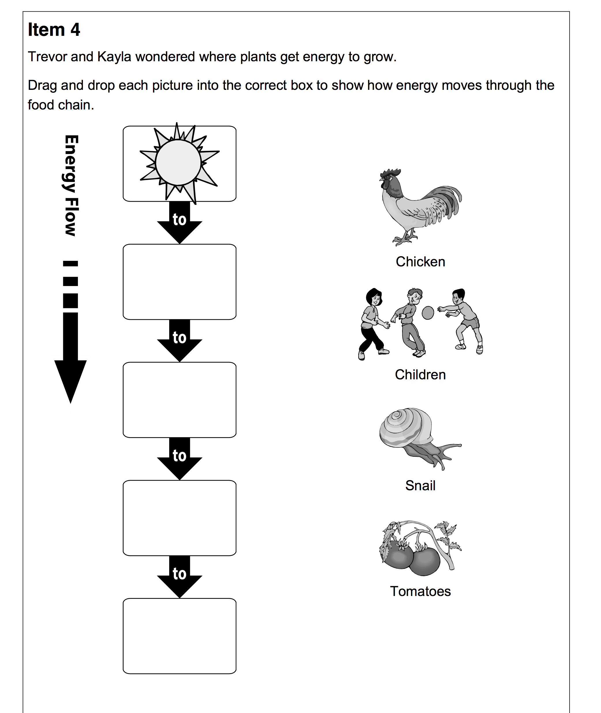</img>

--- &nologo

# Example Item Specifications

 Source p. 16 <a href="https://osse.dc.gov/sites/default/files/dc/sites/osse/publication/attachments/DC%20Sample%20Items%20Booklet.pdf">https://osse.dc.gov/sites/default/files/dc/sites/osse/publication/attachments/DC%20Sample%20Items%20Booklet.pdf</a> 

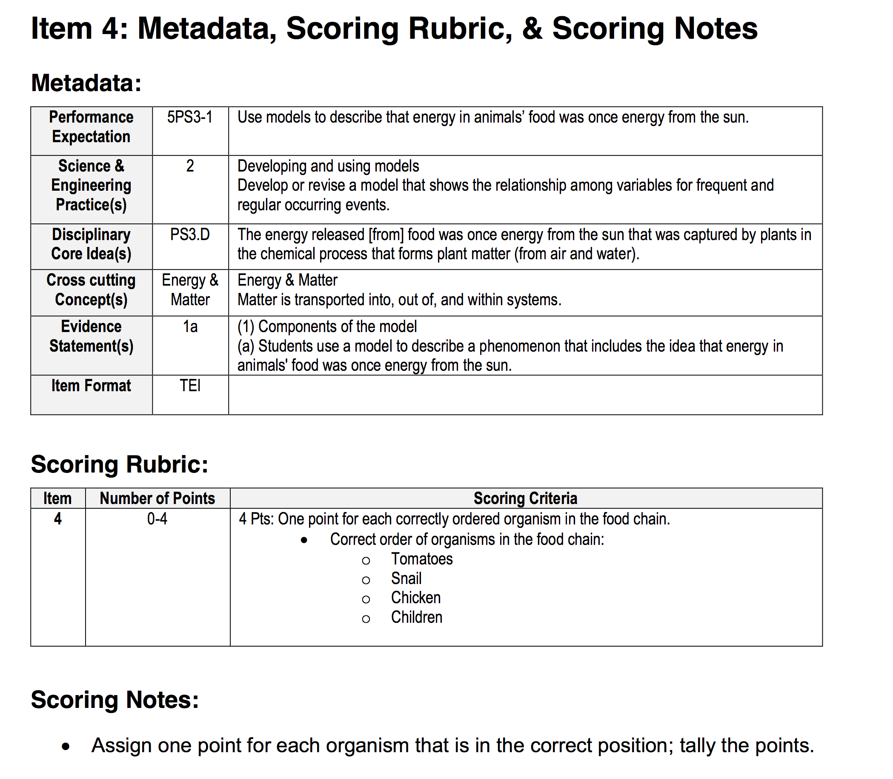</img>

--- 

## Multidimenional Model for Example Item

Imagine a model where each NGSS dimension is measured
- Practices
- Core Ideas
- Cross-cutting Concepts

---

## The Curse of Dimensionality

>- Although a multidimensional model for a NGSS item sounds straight forward, there is a catch...
>- In general, as more dimensions are measured by a test, more items are needed to reach a reliable level of measurement for each dimension
>- More items means more time for testing

--- &nologo

# More Dimensions $\longrightarrow$ More Items

<iframe src="https://jtemplin.shinyapps.io/subscorerel/" style="width:100%; height=900px"></iframe>

---

## Diagnostic Classification Models

DCMs represent student abilities with ordinal categories instead of scores
>- Why: In short it takes fewer items to classify a person with high reliability than it does to provide a continuous score with a high reliabilty
>- How: Grouping students into homogeneous categories (masters vs. non-masters)
>  - Students within a category are considered to have the same amount of ability
>  - The masters category contains students that have more ability than the non-masters category
>- Goal: To provide multiple "scores" per test with a high reliabilty
>- Goal: To make sure tests are of a reasonable length

<!--TO CONSIDER: ADD IMAGE OF CONTINUUM VS CATEGORIES HERE -->

---

## Names for Diagnostic Classification Model 

DCMs have been called by many names:
- Cognitive diagnosis models
- Skills assessment models
- Cognitive psychometric models
- Latent response models
- Restricted (constrained) latent class models
- Multiple classification models
- Structured located latent class models
- Structured item response theory

--- 

## Score Reliability Comparison

From: Templin and Bradshaw (2013; Journal of Classification)
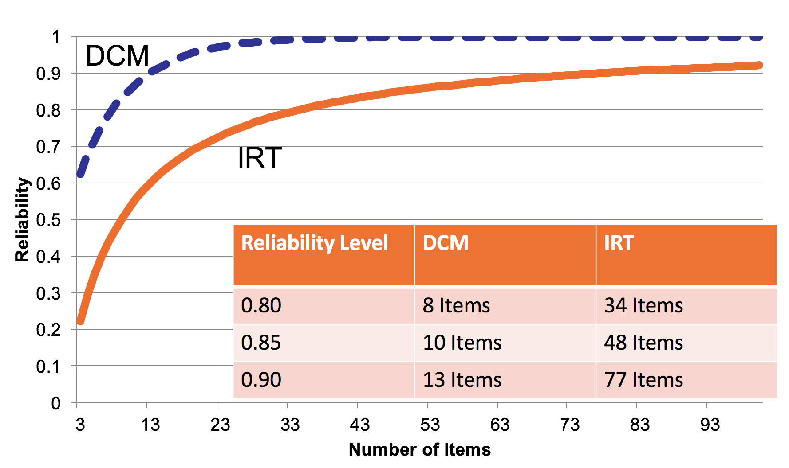

--- &nologo

# DCM Reliability

<iframe src="https://jtemplin.shinyapps.io/dcmrel/" style="width:100%; height=900px"></iframe>

--- 

## IRT Model: Continuous Scores

# Item Characteristic Curve for an Item Measuring One Score

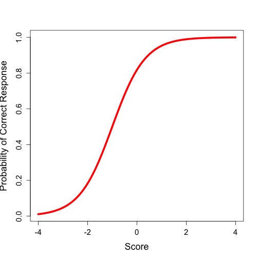

--- 

__Technical details__:

IRT Model Parameterization

For a person $p$ and an item $i$, the two-parameter logistic IRT model specifies:

$$P(X_{pi}=1 \middle| \theta_p) = \frac{\exp\left({a_i\left(\theta_p - b_i\right)}\right)}{1+\exp\left({a_i\left(\theta_p - b_i\right)}\right)} = \frac{\exp\left(\lambda_{i0} + \lambda_{i1} \theta_p \right)}{1+\exp\left(\lambda_{i0} + \lambda_{i1} \theta_p \right)}$$

Where:
<ul>
<li> $\theta_p \sim N(0,1)$ is the person-specific latent variable (ability) </li>
<li> $a_i$ is the item-specific discrimination parameter </li>
<li> $b_i$ is the item-specific difficulty parameter </li>
<li> $\lambda_{i0} = -a_ib_i$ is the item-specific intercept </li>
<li> $\lambda_{i1} = a_i$ is the item-specific slope </li>
</ul>

--- 

## DCM: Categorical Scores 

# Item Characteristic Bar Chart for an Item Measuring One Score

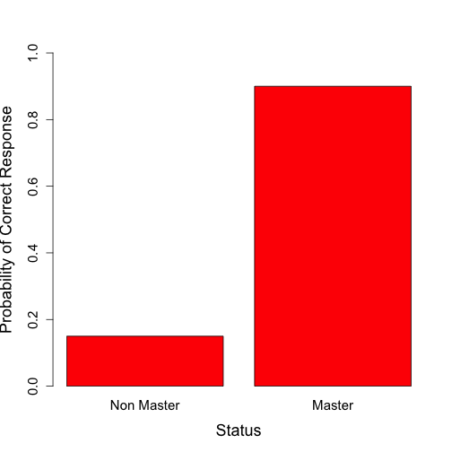

--- 

## DCM: Categorical Score 

# Item Characteristic Bar Chart (Two Scores)

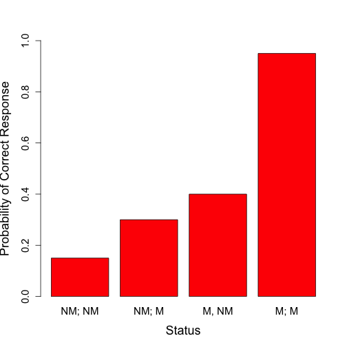

---

__Technical details__:

 DCM Model Parameterization (One Score) 

For a person $p$ and an item $i$, the model specifies:

$$P(X_{pi}=1 | \alpha_p) = \frac{\exp\left(\lambda_{i,0} + \lambda_{i,1,(1)} \alpha_p \right)}{1+\exp\left(\lambda_{i,0} + \lambda_{i,1,(1)} \alpha_p \right)}$$

Where:
<ul>
<li> $\alpha_p \sim B(p_{\alpha})$ is the person-specific latent variable (mastery status; 0=non master 1=master) </li>
<li> $\lambda_{i,0}$ is the item-specific intercept </li>
<li> $\lambda_{i,1,(1)}$ is the item-specific main effect </li>
</ul>

 DCM Model Parameterization (Two Scores) 

For a person $p$ and an item $i$, the model specifies:

$$P(X_{pi}=1 | \alpha_p) = \frac{\exp\left(\lambda_{i,0} + \lambda_{i,1,(1)} \alpha_{p1} + \lambda_{i,1,(2)} \alpha_{p2}+ \lambda_{i,2,(1,2)} \alpha_{p1}\alpha_{p2}\right)}{1+\exp\left(\lambda_{i,0} + \lambda_{i,1,(1)} \alpha_{p1} + \lambda_{i,1,(2)} \alpha_{p2}+ \lambda_{i,2,(1,2)} \alpha_{p1}\alpha_{p2}\right)}$$

Where:
<ul>
<li> $\alpha_p \sim B(p_{\alpha})$ is the person-specific latent variable (mastery status; 0=non master 1=master) 
<li> $\lambda_{i,0}$ is the item-specific intercept </li>
<li> $\lambda_{i,1,(1)}$ is the item-specific main effect for $\alpha_{p1}$ </li>
<li> $\lambda_{i,1,(2)}$ is the item-specific main effect for $\alpha_{p2}$ </li>
<li> $\lambda_{i,2,(1,2)}$ is the item-specific interaction for $\alpha_{p1}$ and for $\alpha_{p2}$ </li>
</ul>

--- 

## Example of DCM Score Report

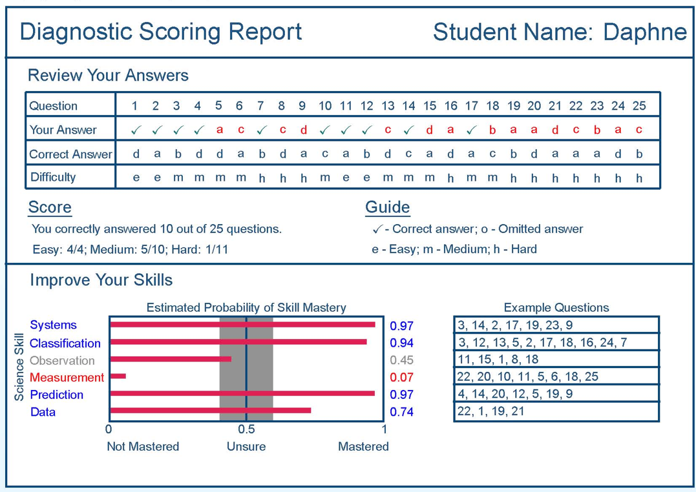

---

## Section Summary

>- Assessing multiple dimensions simultaneously is difficult
>- More dimensions necessitates one or more of:
>  - Changes to the score (e.g., from continuous to categorical)
>  - More items on the assessment

 

--- 

## A (Realistic) Model for Assessing NGSS Dimensions Multidimensionally

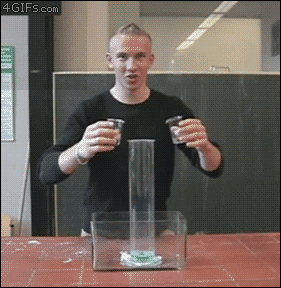

---

## Model Building

Here is an idea intended to prompt a discussion of what a multidimensional model for NGSS assessment might look like

Within a given grade level:

>- Measure content domain as a continuous trait, yielding scores for assessed topics:
>  - Physical Sciences
>  - Life Sciences
>  - Earth and Space Sciences
>  - Engineering, Technology, and Applications
>- Measure cross-cutting concepts as an ordinal trait
>  - Yielding a mastery status for each concept
>- Measure practices as an ordinal trait
>  - Yielding a mastery status for each concept

---

## Hypothetical Specification

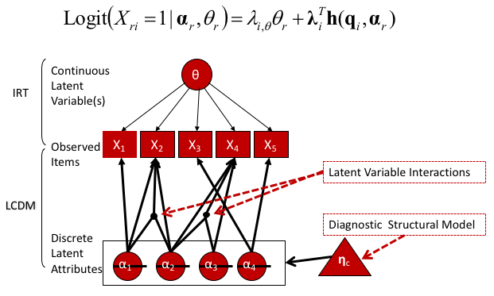

--- &nologo

# Dichotomous Item Model

<iframe src = "https://jtemplin.shinyapps.io/itemicc/" style="width:100%; height=900px"></iframe>

---

## Concepts/Practices Are Sequential

# Can Build Linked Assessment that Can Shorten Test

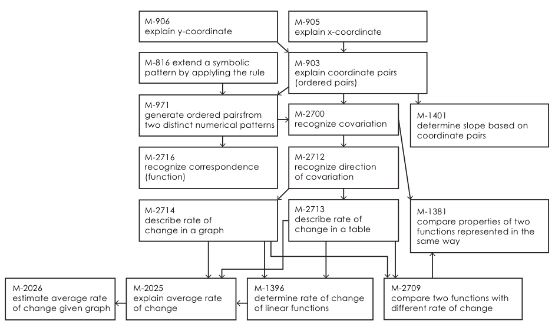

---

## Concluding Remarks

---

## Concluding Remarks

>- Obtaining meaningful and reliable scores/diagnoses from multidimensional assessment is difficult
>  - Takes planfulness from test development to scoring to score reporting
>- Multidimensional assessment is useful
>  - More actional information about what students know and where students should study

---

## Concluding Remarks

>- There is more to the psychometric menu than is currently advertised 

> 

 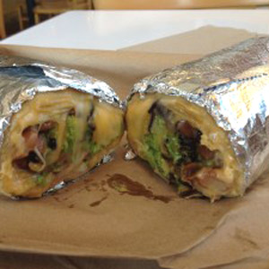
 

 

  Image source: <a href="http://hackthemenu.com/chipotle/secret-menu/quesarito/">
  http://hackthemenu.com/chipotle/secret-menu/quesarito/
  </a>

>- #HackTheMenu

---

## Thank you!

Questions? Comments? Complaints?

- Email: jtemplin@ku.edu
- Website: https://jonathantemplin.com
- Twitter: <a href="https://twitter.com/DrJTemplin">@DrJTemplin</a>
- Slides available: <a href="https://goo.gl/8EN132"> https://goo.gl/8EN132</a>

- Built in R with the slidify package: <a href="http://slidify.org/"> http://slidify.org/</a>
- Talk script available: <a href="https://github.com/jonathantemplin/CCSSO-June2017"> https://github.com/jonathantemplin/CCSSO-June2017</a>

